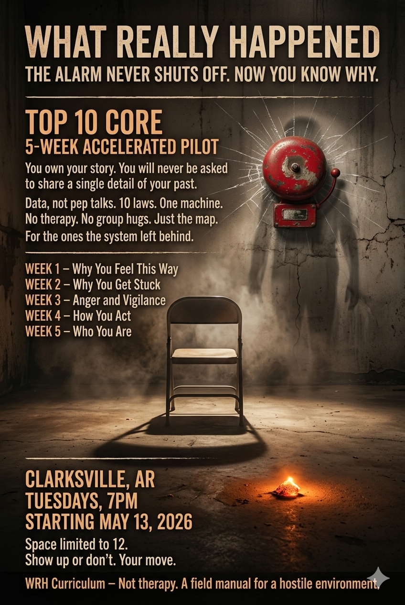

# Top 10 Core: The Summons

This repository contains the recruitment briefing and session scripts for the **5-Week Top 10 Core** program.

## Overview

The program is designed as a 5-week accelerated core covering ten laws that address trauma, survival mechanisms, and personal sovereignty.

### Schedule

| Week | Theme | Laws Covered |
| :--- | :--- | :--- |
| **Week 1** | Why You Feel This Way | [Law 1 (The Alarm)](session-01-the-alarm.md), [Law 2 (The Ghosts)](session-02-the-ghosts.md) |
| **Week 2** | Why You Get Stuck | [Law 3 (The Shelter)](session-03-the-shelter.md), [Law 9 (The Freeze)](session-09-the-freeze.md) |
| **Week 3** | Anger and Vigilance | [Law 4 (The Mourning)](session-04-the-mourning.md), [Law 8 (The Exit)](session-08-the-exit.md) |
| **Week 4** | How You Act | [Law 5 (The War-Work)](session-05-the-war-work.md), [Law 7 (The Disappearing)](session-07-the-disappearing.md) |
| **Week 5** | Who You Are | [Law 6 (The Mirror)](session-06-the-broken-mirror.md), [Law 10 (The Circuit Breaker)](session-10-the-circuit-breaker.md) |

## Contents

- [session-00-the-summons.md](session-00-the-summons.md): The word-for-word script for the recruitment briefing.
- [session-01-the-alarm.md](session-01-the-alarm.md): Script for Session 01 covering Law 1: "Your alarm never shuts off."
- [session-02-the-ghosts.md](session-02-the-ghosts.md): Script for Session 02 covering Law 2: "You're carrying ghosts you never met."
- [session-03-the-shelter.md](session-03-the-shelter.md): Script for Session 03 covering Law 3: "A dangerous shelter is still a shelter."
- [session-04-the-mourning.md](session-04-the-mourning.md): Script for Session 04 covering Law 4: "What you couldn't mourn haunts you."
- [session-05-the-war-work.md](session-05-the-war-work.md): Script for Session 05 covering Law 5: "Work becomes the war you can win."
- [session-06-the-broken-mirror.md](session-06-the-broken-mirror.md): Script for Session 06 covering Law 6: "You were looking in a broken mirror."
- [session-07-the-disappearing.md](session-07-the-disappearing.md): Script for Session 07 covering Law 7: "You learned to disappear."
- [session-08-the-exit.md](session-08-the-exit.md): Script for Session 08 covering Law 8: "You scan every room for exits."
- [session-09-the-freeze.md](session-09-the-freeze.md): Script for Session 09 covering Law 9: "You stop when you can't fight or run."
- [session-10-the-circuit-breaker.md](session-10-the-circuit-breaker.md): Script for Session 10 covering Law 10: "You leave your body."

---
*Note: This program focuses on understanding the "wiring" and "machine" rather than digging through personal trauma.*

- [counter-narrative-articles.md](counter-narrative-articles.md): The Complete WRH Counter-Narrative Document including technical appendix and missing pieces.
